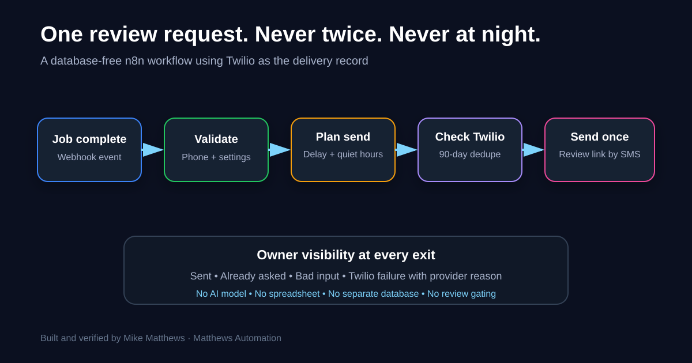

# Google review request by SMS

A standalone n8n workflow for service businesses that want to ask every completed customer for a Google review without sending duplicate requests or texting during quiet hours.

The workflow is deliberately small. It needs n8n and Twilio, not a CRM, spreadsheet, database, or AI model.



## The business problem

Review requests are easy to forget after a job. A basic automation solves that but creates new failure modes: asking the same customer twice, sending at night, counting a failed text as a successful request, or quietly swallowing a Twilio error.

This workflow accepts a completed-job event, plans a safe send time, checks Twilio's message log for an earlier successful request inside the repeat window, sends the request, and tells the owner what happened.

## What it does

1. Receives `phone`, `name`, and `job` at a webhook.
2. Validates the US phone number and configuration before starting.
3. Waits for the configured delay, two hours by default.
4. Moves a send out of quiet hours, 8 PM to 8 AM by default.
5. Prevents two closely spaced webhook calls from opening duplicate waits.
6. Reads the Twilio message log and skips customers who received the same review link in the last 90 days.
7. Ignores failed, undelivered, and canceled attempts when checking for an earlier request.
8. Sends one review request and optionally texts the owner with sent, skipped, or failed status.
9. Uses the same review link for every customer. There is no rating screen and no review gating.

## Requirements

- n8n Cloud or self-hosted n8n with the Code, Wait, Webhook, HTTP Request, If, Set, Respond to Webhook, and Twilio nodes.
- A Twilio account and SMS-capable number.
- A Twilio credential in n8n.
- A direct Google review link for the business.
- Customer permission and messaging practices appropriate to your jurisdiction and Twilio account.

No community nodes are required.

## Install

1. Import [`workflow/google-review-request-sms.json`](workflow/google-review-request-sms.json) into n8n.
2. Open every Twilio or Twilio-authenticated HTTP node and select your Twilio credential.
3. Open **Your settings** and replace the placeholder values:

   - `business_name`
   - `business_number`
   - `owner_cell`
   - `timezone`
   - `review_link`

4. Review the optional settings:

   - `delay_minutes`: `120`
   - `quiet_start`: `20:00`
   - `quiet_end`: `08:00`
   - `repeat_days`: `90`
   - `owner_updates`: `true`
   - `review_text`: message template using `{name}`, `{business}`, `{job}`, and `{link}`

5. Save and publish the workflow only after using the safe test plan below.
6. Send completed-job events to the production webhook URL from the system that records job completion.

Keep the webhook URL private. Anyone who has it can start an execution.

## Sample input

POST JSON to the webhook:

```json
{
  "phone": "+14045550123",
  "name": "Test Customer",
  "job": "water heater repair"
}
```

The same payload is in [`examples/job-finished.json`](examples/job-finished.json).

## Expected webhook response

Accepted:

```json
{
  "ok": true,
  "send_at": "2026-09-22T18:00:00.000Z",
  "reason": ""
}
```

Rejected configuration or input:

```json
{
  "ok": false,
  "send_at": null,
  "reason": "the review link in Your settings is not set"
}
```

`send_at` is illustrative. The real value depends on the current time, delay, timezone, and quiet hours.

## Safe test plan

Use a phone you control. Do not test against a customer.

1. Import the workflow as an unpublished development copy.
2. Use fictional business details, your own test handset, and your real Twilio credential.
3. Set `delay_minutes` to `0` and use a quiet-hours window that is not active.
4. Post the sample event and verify one review request arrives.
5. Post it again and verify the second request is skipped.
6. Use a new controlled number, set a two-minute delay, and post the same event twice a few seconds apart. Verify only one request is sent.
7. Use an invalid number and verify the owner receives Twilio's failure reason while the failed attempt does not block a later retry.
8. Turn `owner_updates` off and verify the customer request still sends without an owner success text.
9. Restore the defaults and placeholders before exporting or sharing.

The package validator checks JSON structure, expected nodes, placeholder configuration, credential stripping, and obvious secret or production-identifier patterns:

```powershell
powershell -ExecutionPolicy Bypass -File scripts/validate.ps1
```

## Verified results

The workflow was run on 2026-09-21 through its production webhook against a real Twilio number, with the owner's own handset acting as the customer. Ten scenarios were exercised live, including invalid input, missing configuration, a successful request, 90-day deduplication, near-simultaneous duplicate events, quiet-hours deferral, Twilio rejection, failed-send retry eligibility, disabled owner updates, and expiry of the in-flight duplicate guard.

All final versions of those scenarios passed. Three defects were found during testing and fixed before export:

- In-flight duplicate memory did not expire after a Wait node.
- The standard Twilio node hid the useful provider error.
- Failed sends were incorrectly counted as prior review requests.

The planning and deduplication code also passed 22 clock-frozen local cases. See [`docs/VERIFIED-RESULTS.md`](docs/VERIFIED-RESULTS.md) for the precise evidence and limitations.

## Important implementation decisions

- **Twilio is the record of delivery.** The workflow checks the provider's own message log, so it does not require a second database that can drift.
- **Failed attempts do not count.** Failed, undelivered, and canceled messages are ignored when deciding whether a customer was already asked.
- **Quiet hours are planned before waiting.** The execution resumes at the actual allowed send time.
- **A short in-flight guard handles retries.** Workflow static data blocks duplicate waits until two minutes after the planned send time, when the Twilio log becomes the source of truth.
- **The customer path is not scored.** Every completed customer gets the same link, avoiding review gating.
- **The webhook responds immediately.** The calling system does not stay open during the delay or provider checks.

## Known limitations

- Phone normalization accepts US numbers only.
- The default two-hour delay and a full overnight quiet-hours hold were planned in tests but not observed end to end at their full real-world duration.
- Twilio error `21610` has a plain-language message in the workflow, but an actual opted-out test handset was not used for this workflow.
- All live customer texts went to the same controlled handset.
- If an execution is canceled or crashes while waiting, the number remains in the in-flight guard until two minutes after its planned send time.
- The webhook has no built-in authentication. Keep its URL private or add authentication before exposing it outside a trusted system.
- This workflow checks whether the same review link was sent. If the link changes, the old request will not match.

## Public-template gap

n8n's public library includes broad, multi-service appointment and review systems and several workflows for replying to reviews. A current appointment-plus-review template uses Google Sheets, Gmail, Twilio, Slack, and other services and is sold as a paid template. Several review workflows focus on AI-generated replies or route only high ratings to Google. This workflow fills a narrower gap: a free, database-free, no-AI review request with quiet hours, provider-backed deduplication, failure visibility, and no review gating.

See [`docs/DECISION.md`](docs/DECISION.md) for the candidate comparison and source links.

## License

MIT. See [`LICENSE`](LICENSE).

